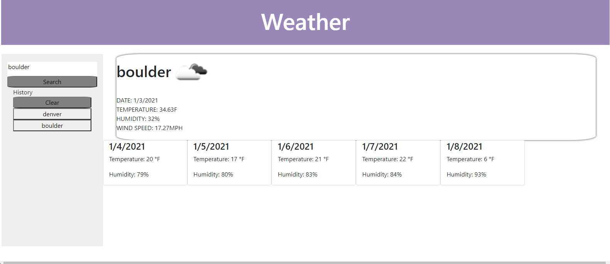

# Weather Dashboard

## Table of Contents

* [Description](#description)
* [Links](#links)
* [Screenshots](#screenshots)
* [Installation](#installation)
* [Usage](#usage)
* [Technologies Used](#technologies)
* [Questions](#questions)

## Description

This is a simple vanilla js application that you can use to search a city for the weather and a 5 day forcast. 

## Links

[Deployed Weather App](https://benimahat1291.github.io/weatherApp/)

## Screenshots

## Installation Instructions
open index.html in you default web browser

## Usage

on the left side there is a search bar where you can search for a city you would like to see the weather in. The history populates with you old searchs. 
 

## Technologies Used

HTML, CSS, JS, BootStrap, server side API's

## Questions

If you have further projects and questions, you can find me on Github: [GITHUB](https://github.com/benimahat1291). 
please visit my portfolio to find contact information: [BENI MAHAT](https://benimahat1291.github.io/Portfolio_v2/#/). 

